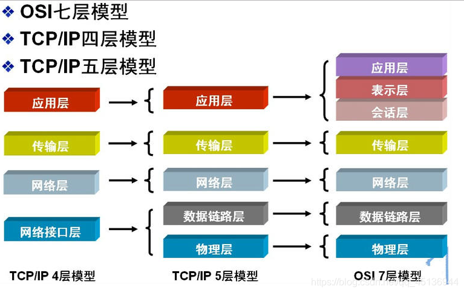

# 计算机网络分层

## OSI七层结构

每一层分别完成不同的工作
1、应用层：
为计算机用户提供接口和服务
2、表示层：
数据处理（编码解码、加密解密等）
3、会话层：
管理（建立、维护、重连）通信会话
4、传输层：
管理端到端的通信连接
5、[网络层](https://so.csdn.net/so/search?q=网络层&spm=1001.2101.3001.7020)：
数据路由（决定数据在网络上的路径）
6、数据链路层：
管理相邻结点之间的数据通信
7、物理层：
数据通信的光电物理特性

OSI本来想成为全球计算机都遵循的标准，但是其在市场化的过程中困难重重，
而TCP/IP在全球范围成功运行；
OSI并没有成为广为使用的标准模型。

## TCP/IP四层模型

1、应用层：
包括OSI七层模型中应用层、表示层、会话层的职能；
包括HTTP，FTP，SMTP，POP3等协议；
2、传输层：
包括OSI七层模型中传输层的职能；
包括TCP/UDP协议；
3、网络层：
包括OSI七层模型中网络层的职能；
包括IP协议；
4、网络接口层：
包括OSI七层模型中数据链路层、物理层的职能；
包括Ethernet、PPP协议等；

## TCP/IP层次对应协议

- 应用层：HTTP，DNS(域名解析协议)，FTP(文件传输协议)
- 传输层：UDP,TCP
- 网络层：IP(网际协议)，ICMP(互联网控制报文协议），IGMP（互联网组管理协议），RIP

## 分层原则

1、各层之间相互独立，层与层之间的耦合度是非常低的；
2、每一层有足够的灵活性；
3、各层之间完全解耦；

- 各层之间互相独立，我们可以只关心一个层面，比如我们搞软件，就不用关心光纤。
- 每一层要有足够的灵活性。这是留出一定空间，给未来出现的难题留出解决的地方。
- 各层之间解耦，也就是某一层他的上一层或下一层出现变化，也不会影响这一个层。

## 常见的网络协议

应用层常见的协议？

**HTTP（Hypertext Transfer Protocol，超文本传输协议）**：基于 TCP 协议，是一种用于传输超文本和多媒体内容的协议，主要是为 Web 浏览器与 Web 服务器之间的通信而设计的。当我们使用浏览器浏览网页的时候，我们网页就是通过 HTTP 请求进行加载的。

**SMTP（Simple Mail Transfer Protocol，简单邮件发送协议）**：基于 TCP 协议，是一种用于发送电子邮件的协议。注意 ⚠️：SMTP 协议只负责邮件的发送，而不是接收。要从邮件服务器接收邮件，需要使用 POP3 或 IMAP 协议。

**POP3/IMAP（邮件接收协议）**：基于 TCP 协议，两者都是负责邮件接收的协议。IMAP 协议是比 POP3 更新的协议，它在功能和性能上都更加强大。IMAP 支持邮件搜索、标记、分类、归档等高级功能，而且可以在多个设备之间同步邮件状态。几乎所有现代电子邮件客户端和服务器都支持 IMAP。

**FTP（File Transfer Protocol，文件传输协议）** : 基于 TCP 协议，是一种用于在计算机之间传输文件的协议，可以屏蔽操作系统和文件存储方式。注意 ⚠️：FTP 是一种不安全的协议，因为它在传输过程中不会对数据进行加密。建议在传输敏感数据时使用更安全的协议，如 SFTP。

**Telnet（远程登陆协议）**：基于 TCP 协议，用于通过一个终端登陆到其他服务器。Telnet 协议的最大缺点之一是所有数据（包括用户名和密码）均以明文形式发送，这有潜在的安全风险。这就是为什么如今很少使用 Telnet，而是使用一种称为 SSH 的非常安全的网络传输协议的主要原因。

**SSH（Secure Shell Protocol，安全的网络传输协议）**：基于 TCP 协议，通过加密和认证机制实现安全的访问和文件传输等业务

**RTP（Real-time Transport Protocol，实时传输协议）**：通常基于 UDP 协议，但也支持 TCP 协议。它提供了端到端的实时传输数据的功能，但不包含资源预留存、不保证实时传输质量，这些功能由 WebRTC 实现。

**DNS（Domain Name System，域名管理系统）**: 基于 UDP 协议，用于解决域名和 IP 地址的映射问题