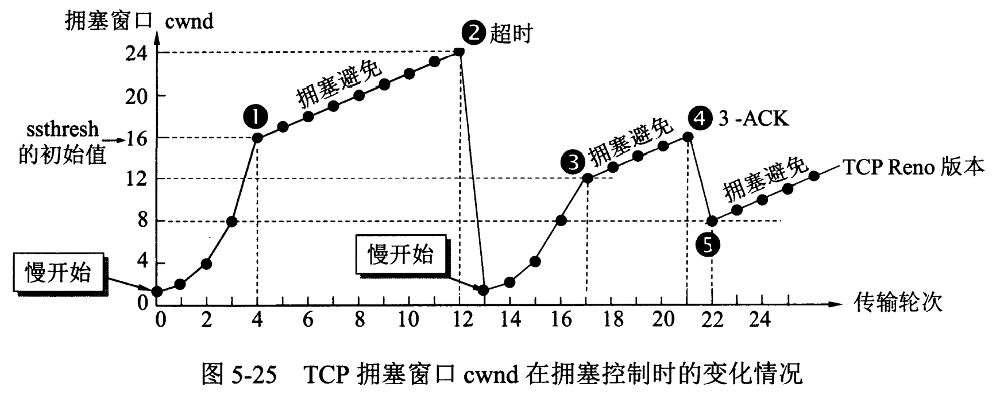

## TCP如何实现流量控制

使用滑动窗口协议实现流量控制。防止发送方发送速率太快，接收方缓存区不够导致溢出。接收方会维护一个接收窗口 receiver window（窗口大小单位是字节），接受窗口的大小是根据自己的资源情况动态调整的，在返回ACK时将接受窗口大小放在TCP报文中的窗口字段告知发送方。发送窗口的大小不能超过接受窗口的大小，只有当发送方发送并收到确认之后，才能将发送窗口右移。

发送窗口的上限为接受窗口和拥塞窗口中的较小值。接受窗口表明了接收方的接收能力，拥塞窗口表明了网络的传送能力。

------

## 什么是0窗口？接收窗口为0时会怎样？

如果接收方没有能力接收数据，就会将接收窗口设置为0，这时发送方必须暂停发送数据，但是会启动一个持续计时器(persistence timer)，到期后发送一个大小为1字节的探测数据包，以查看接收窗口状态。如果接收方能够接收数据，就会在返回的报文中更新接收窗口大小，恢复数据传送。

------

## TCP的拥塞控制是怎么实现的？

> **假定**：
> 1.数据是单方向传送，而另一个方向只传送确认
> 2.接收方总是有足够大的缓存空间，因而发送发发送窗口的大小由网络的拥塞程度来决定
> 3.以TCP报文段的个数为讨论问题的单位，而不是以字节为单位

在tcp双方建立逻辑链接关系时， `拥塞窗口cwnd`的值被设置为1，还需设置`慢开始门限ssthresh`

拥塞控制主要由四个算法组成：**慢启动（Slow Start）、拥塞避免（Congestion voidance）、快重传 （Fast Retransmit）、快恢复（Fast Recovery）**

1. 慢启动：刚开始发送数据时，先把拥塞窗口（congestion window）设置为一个最大报文段MSS的数值，每收到一个新的确认报文之后，就把拥塞窗口加1个MSS。这样每经过一个传输轮次（或者说是每经过一个往返时间RTT），拥塞窗口的大小就会加倍

   发送方此时可以连续发送两个数据报文段，接收方收到该数据报文段后，给发送方一次发回2个确认报文段，发送方收到这两个确认报文后，将拥塞窗口的值加2变为4，发送方此时可连续发送4个报文段，接收方收到4个报文段后，给发送方依次回复4个确认报文，发送方收到确认报文后，将拥塞窗口加4，置为8，发送方此时可以连续发送8个数据报文段，接收方收到该8个数据报文段后，给发送方一次发回8个确认报文段，发送方收到这8个确认报文后，将拥塞窗口的值加8变为16。

   当前的拥塞窗口cwnd的值已经等于慢开始门限值，之后改用拥塞避免算法。

2. 拥塞避免：当拥塞窗口的大小达到慢开始门限(slow start threshold)时，开始执行拥塞避免算法，拥塞窗口大小不再指数增加，而是线性增加，即每经过一个传输轮次只增加1MSS.

   无论在慢开始阶段还是在拥塞避免阶段，只要发送方判断网络出现拥塞（其根据就是没有收到确认），就要把慢开始门限ssthresh设置为出现拥塞时的发送方窗口值的一半（但不能小于2）。然后把拥塞窗口cwnd重新设置为1，执行慢开始算法。**（这是不使用快重传的情况）**

   假设24个报文段在传输过程中丢失4个，接收方只收到20个报文段，给发送方依次回复20个确认报文段，一段时间后，丢失的4个报文段的重传计时器超时了，发送发判断可能出现拥塞，更改cwnd和ssthresh.并重新开始慢开始算法

3. 快重传：**快重传要求接收方在收到一个失序的报文段后就立即发出重复确认（为的是使发送方及早知道有报文段没有到达对方）而不要等到自己发送数据时捎带确认**。快重传算法规定，发送方只要一连收到三个重复确认就应当立即重传对方尚未收到的报文段，而不必继续等待设置的重传计时器时间到期。

   无论在慢开始阶段还是在拥塞避免阶段，只要发送方判断网络出现拥塞（其根据就是没有收到确认），就要把慢开始门限ssthresh设置为出现拥塞时的发送方窗口值的一半（但不能小于2）。然后把拥塞窗口cwnd重新设置为1，执行慢开始算法。**（这是不使用快重传的情况）**

   假设24个报文段在传输过程中丢失4个，接收方只收到20个报文段，给发送方依次回复20个确认报文段，一段时间后，丢失的4个报文段的重传计时器超时了，发送发判断可能出现拥塞，更改cwnd和ssthresh.并重新开始慢开始算法

[

4. 快恢复：当发送方连续收到三个重复确认时，就把慢开始门限减半，然后执行拥塞避免算法。不执行慢开始算法的原因：因为如果网络出现拥塞的话就不会收到好几个重复的确认，所以发送方认为现在网络可能没有出现拥塞。		
   也有的快重传是把开始时的拥塞窗口cwnd值再增大一点，即等于 ssthresh + 3*MSS 。这样做的理由是：既然发送方收到三个重复的确认，就表明有三个分组已经离开了网络。这三个分组不再消耗网络的资源而是停留在接收方的缓存中。可见现在网络中减少了三个分组。因此可以适当把拥塞窗口扩大些。

> [TCP的拥塞控制（详解）-CSDN博客](https://blog.csdn.net/qq_41431406/article/details/97926927)
>
> [TCP拥塞控制——快重传和快恢复_简述在tcp数据传输的拥塞控制中的快重传算法和快恢复算法?-CSDN博客](https://blog.csdn.net/qq_36953135/article/details/77506009)

------

