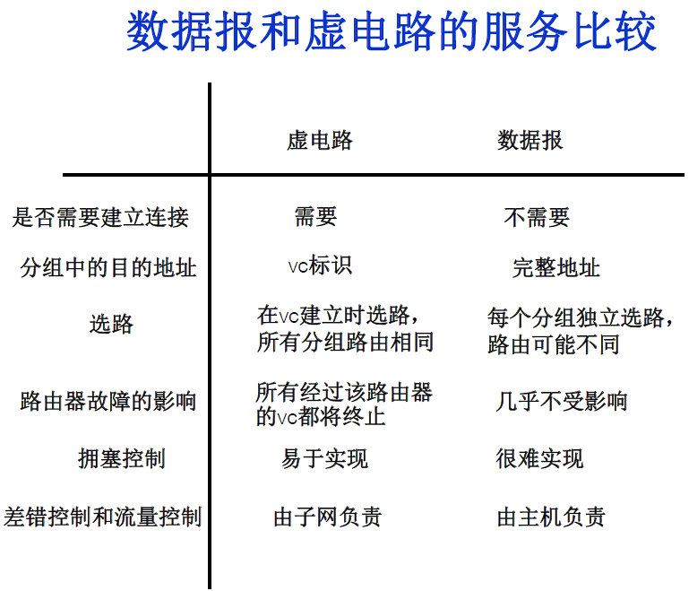

## TCP和UDP的区别

1. tcp是面向连接的，udp是无连接的。（udp发送数据之前无需建立连接）
2. tcp是可靠的，udp不可靠。（UDP接收方收到报文后，不需要给出任何确认）
3. TCP只支持点对点通信，UDP支持一对一、一对多、多对一、多对多；
4. tcp面向字节流，udp面向报文（面向字节流是指发送数据时以字节为单位，一个数据包可以拆分成若干组进行发送，而UDP一个报文只能一次发完。）
5. TCP有拥塞控制机制，UDP没有。网络出现的拥塞不会使源主机的发送速率降低，这对某些实时应用是很重要的，比如媒体通信，游戏；
6. TCP首部开销（20字节）比UDP首部开销（8字节）要大
7. UDP 的主机不需要维持复杂的连接状态表

------

## 什么时候选择TCP，什么时候选择UDP？

对某些实时性要求比较高的情况，选择UDP，比如游戏，媒体通信，实时视频流（直播），即使出现传输错误也可以容忍；其它大部分情况下，HTTP都是用TCP，因为要求传输的内容可靠，不出现丢失

------

## HTTP可以使用UDP吗？

HTTP不可以使用UDP，HTTP需要基于可靠的传输协议，而UDP不可靠

注：**http 3.0 使用udp实现** https://zh.wikipedia.org/wiki/HTTP/3

------

## 面向连接和无连接的区别

无连接的网络服务（数据报服务）-- 面向连接的网络服务（虚电路服务）

虚电路服务：首先建立连接，所有的数据包经过相同的路径，服务质量有较好的保证；

数据报服务：每个数据包含目的地址，数据路由相互独立（路径可能变化）；网络尽最大努力交付数据，但不保证不丢失、不保证先后顺序、不保证在时限内交付；网络发生拥塞时，可能会将一些分组丢弃；

------

## TCP如何保证传输的可靠性？

1. 数据包校验

2. 对失序数据包重新排序（TCP报文具有序列号） 

3. 丢弃重复数据

4. 应答机制：接收方收到数据之后，会发送一个确认（通常延迟几分之一秒）；

5. 超时重发：发送方发出数据之后，启动一个定时器，超时未收到接收方的确认，则重新发送这个数据；

6. 流量控制：确保接收端能够接收发送方的数据而不会缓冲区溢出

   ------

   